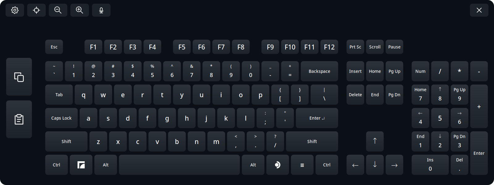

# Full Keyboard for Steam Frame

A full-size alternative to Steam Frame's built-in virtual keyboard, made for everyday use on the headset. It adds proper arrow keys, a numpad, Ctrl and Alt, and dedicated Copy and Paste buttons for browsing, signing in, editing text, and using local apps.

**This is a separate app, not a replacement for the system keyboard.** Launch **Full Keyboard** yourself; SteamOS's existing keyboard button still opens the original keyboard.



*The default English layout and Graphite theme, captured from the app's native renderer.*

## What it does

- Full-size layout with F1–F12, navigation keys, arrow keys, numpad, Ctrl, Alt, and Shift.
- Dedicated Copy and Paste icons that send Ctrl+C and Ctrl+V.
- Dedicated speech-to-text dictation button for fully offline, on-device voice typing.
- Native Enter and numpad Enter keys. The focused app decides whether Enter submits or inserts a newline.
- Controller laser typing, press/release haptic clicks, and subtle hover feedback.
- Grab anywhere to move and rotate the keyboard, with thumbstick depth adjustment and size controls.
- Dashboard following, saved placement, and relaunch-to-recenter recovery.
- Editable layouts, languages, and themes, with a settings menu inside VR.
- English, German, French, Spanish, Italian, Brazilian Portuguese, Russian, Ukrainian, Japanese, Chinese and Korean options. Chinese has Simplified and Traditional Pinyin; Korean uses two-set Hangul.

## Where it works

Full Keyboard is a quality-of-life tool for the **on-device experience**. It is designed for the Frame dashboard and local apps, including desktop and floating app windows. Focus a text field in the app, then type using the controller laser.

It is **not a keyboard for streamed VR applications such as VRChat**. Closing the dashboard hides the keyboard and releases its input. It does not capture controls or send keys to a streamed VR app. Reopening the dashboard brings it back.

This is an early release. App focus, non-US keymaps, and Japanese input can behave differently across applications; see [known limitations and troubleshooting](docs/runtime.md). Japanese composition has automated and dedicated-receiver coverage, but still needs feedback from fluent Japanese users.

## Install manually

No AI tools, compilation, `sudo`, or SteamOS write access are needed for the release package.

1. On the **Steam Frame**, open the [GitHub Releases page](https://github.com/TaiKeid/steam-frame-full-keyboard/releases) in a browser. Download `framekeyboard-0.5.0-aarch64.tar.gz` and `SHA256SUMS` from the release assets into **Downloads**. Do not download GitHub's automatic source-code archive for this installation.
2. Open a terminal in the Frame's desktop environment and run:

   ```sh
   cd ~/Downloads
   sha256sum -c SHA256SUMS
   tar -xzf framekeyboard-0.5.0-aarch64.tar.gz
   cd framekeyboard-0.5.0-aarch64
   bash install.sh
   ```

   Continue only if the checksum reports `OK`. For a newer version, use its archive and extracted directory names.
3. Return to the Frame's dashboard and open **Full Keyboard** from the app launcher. The headset's VR session must already be running. You can also launch it from a terminal:

   ```sh
   ~/.local/bin/framekeyboard
   ```

The installer adds a desktop application entry named **Full Keyboard**. If you also want a Steam Library shortcut, use Steam's **Add a Non-Steam Game** option and select Full Keyboard. A manually created shortcut has its own name; rename an old FrameKeyboard shortcut in its Properties if needed.

Everything installs under your home directory. The installer preserves settings and custom profiles, retains the previous release for rollback, and does not enable autostart or alter Steam files. Internal filenames and commands remain `framekeyboard`.

To update, **close the keyboard**, download the new release assets, and repeat the installation steps. The installer refuses to overwrite an already installed version. See [rollback and removal](docs/runtime.md#update-rollback-and-removal) for recovery instructions.

## Use the keyboard

| Action | Control |
| --- | --- |
| Type | Point at a key and press the controller trigger |
| Use a shortcut | Tap Ctrl, Alt, or Shift, then another key; or hold the modifier with one controller and press a key with the other |
| Super shortcuts | Tap the left Frame icon, then a key, or hold it with the other controller |
| Desktop application menu | Tap the right SteamOS icon for a native right Super press/release; the desktop controls its action |
| Clear a tapped modifier | Tap it again |
| Copy / paste | Use the two icons on the left; select text first when copying |
| Move / rotate | Point anywhere on the keyboard, hold grab/grip, move your hand, then release |
| Move farther / closer | While grabbing, push that same controller's thumbstick up / down |
| Change size | Use the smaller / larger icons in the toolbar |
| Change layout, language, or theme | Open the gear icon, choose profiles, then **Apply and save** |
| Recenter | Use the recenter icon, or launch Full Keyboard again |
| Voice typing (Dictate) | Tap the microphone icon in the toolbar, speak, and tap it again when done |
| Close | Use the × icon |

**If the keyboard has drifted out of reach, launch the app again.** When it is already running, another launch recenters the existing keyboard beneath the current dashboard instead of opening a second one. Its size is preserved. If the dashboard is closed, recentering waits until it opens.

Closing and reopening normally restores the last position, rotation, and size. Moving or tilting the dashboard carries the keyboard with it, preserving your chosen offset. After releasing a grab, a sideways lean within 5° eases level over 500 ms. This preserves the desk-like forward tilt and never fights your hand during a grab.

## Languages and customization

Select a language in Settings and **Apply and save**. The normal Frame launcher
sends characters from that layout independently of the system keyboard layout,
including Shift, Caps Lock, AltGr and dead-key accents. No matching SteamOS layout
or relaunch is needed. A fresh install defaults to English; later launches use
your saved selection. System locale and system layout switching do not change it.
See [language setup and switching](docs/languages.md).

For Japanese, choose a Japanese language or the JIS layout in Settings to reveal the **Romaji / Kana / JIS** presets. Romaji and Kana compose text in the keyboard and use the system Anthy dictionary for kanji conversion. Space converts; Enter commits the composition. Another Enter sends a normal Enter key. JIS mode requires an existing system IME. See [Japanese input](docs/japanese.md).

Chinese and Korean compose locally and can be selected alongside English and integrated Japanese without a system layout change. [The language guide](docs/languages.md#chinese-and-korean-composition) explains candidates, Hangul, and input limitations.

Copy a bundled JSON profile from `~/.local/share/framekeyboard/current/share/framekeyboard/` into the matching folder below, edit it, then choose **Reload profiles** in Settings:

```text
~/.config/framekeyboard/layouts/
~/.config/framekeyboard/languages/
~/.config/framekeyboard/themes/
```

Use a new profile `id` to add a choice, or the same `id` to override a bundled one. [Configuration reference](docs/configuration.md) covers fields, favorites, validation, and saved placement.

## How it works

The keyboard is a native C++20 app. Cairo/Pango draw the keys, Vulkan/OpenVR display the panel, and libei sends native controls to the Frame's local Gamescope compositor. A feature-checked Gamescope text-input protocol sends characters resolved from the selected layout, including Japanese, Chinese and Korean composition. It does not run a browser or need an internet connection.

Copy and Paste send shortcuts; the app does not read clipboard contents. It does not log typed text or save composition history. Placement and profile preferences are stored locally.

The visible panel polls input and follows the dashboard at a target 60 Hz. While hidden, polling drops to 4 Hz. It redraws the texture only when its display changes or a key animation runs. Closing the keyboard exits the process. Battery impact has not been benchmarked.

## Development and feedback

- [Build from source](docs/building.md)
- [Architecture and code map](docs/architecture.md)
- [Runtime and troubleshooting](docs/runtime.md)
- [Manual acceptance checks](docs/acceptance.md)
- [Roadmap](docs/plan.md) and [changelog](CHANGELOG.md)
- [Contributing and bug reports](CONTRIBUTING.md)
- [Release checklist](docs/releasing.md)
- [Third-party code and licenses](third_party/README.md)

Please report the app version, SteamOS version, affected app, whether it is a desktop or floating window, and steps to reproduce. Remove private text from screenshots and logs.

## License

Project code is available under the [MIT License](LICENSE). Vendored components keep their [upstream licenses](third_party/README.md).

## AI-generated project disclaimer

This project is fully AI-generated. The author is unfamiliar with C++, so please have patience and understanding. Bugs and rough edges are expected; careful reviews, clear bug reports, and contributions are welcome. Third-party components retain their original authorship and licenses.
